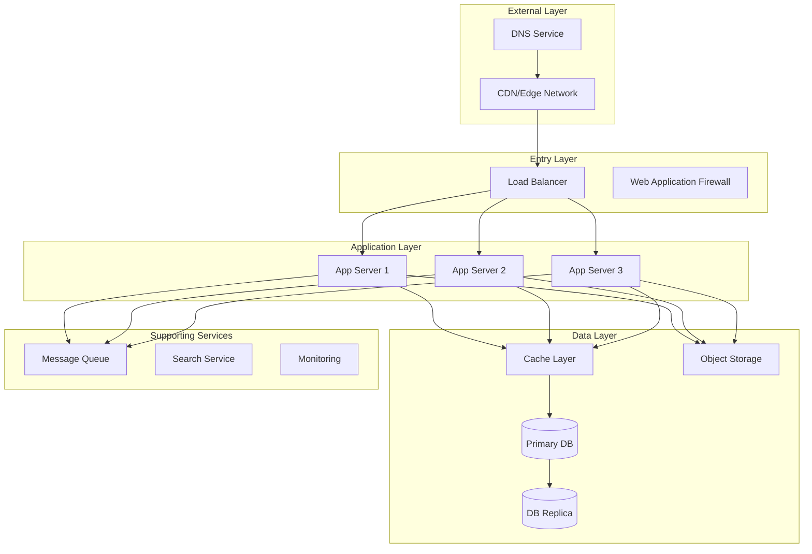

# Infrastructure Setup Guide

This document provides a comprehensive guide for setting up infrastructure for any type of application, covering various deployment scenarios, cloud providers, and infrastructure patterns.

## Infrastructure Architecture Overview

### Basic Architecture Components


## Cloud Provider Setup

### Multi-Cloud Architecture
```yaml
# Infrastructure as Code - Provider Configuration
providers:
  aws:
    regions:
      - us-east-1  # Primary
      - us-west-2  # DR
    services:
      - ec2
      - rds
      - s3
      - cloudfront
      
  azure:
    regions:
      - eastus   # Primary
      - westus2  # DR
    services:
      - virtual_machines
      - cosmos_db
      - blob_storage
      
  gcp:
    regions:
      - us-central1  # Primary
      - us-east1     # DR
    services:
      - compute_engine
      - cloud_sql
      - cloud_storage
```

### Infrastructure as Code Examples

#### Terraform Configuration
```hcl
# main.tf - Generic infrastructure setup
variable "environment" {
  description = "Environment name"
  type        = string
}

variable "project_name" {
  description = "Project name"
  type        = string
}

# Network Infrastructure
module "network" {
  source = "./modules/network"
  
  vpc_cidr = "10.0.0.0/16"
  availability_zones = data.aws_availability_zones.available.names
  
  public_subnets = [
    "10.0.1.0/24",
    "10.0.2.0/24",
    "10.0.3.0/24"
  ]
  
  private_subnets = [
    "10.0.11.0/24",
    "10.0.12.0/24",
    "10.0.13.0/24"
  ]
  
  tags = {
    Environment = var.environment
    Project     = var.project_name
  }
}

# Compute Resources
module "compute" {
  source = "./modules/compute"
  
  instance_type = "t3.medium"
  min_size      = 2
  max_size      = 10
  desired_size  = 3
  
  vpc_id     = module.network.vpc_id
  subnet_ids = module.network.private_subnet_ids
  
  user_data = templatefile("${path.module}/user_data.sh", {
    environment = var.environment
  })
}

# Database
module "database" {
  source = "./modules/database"
  
  engine         = "postgres"
  engine_version = "14.7"
  instance_class = "db.r5.large"
  
  allocated_storage     = 100
  max_allocated_storage = 1000
  
  vpc_id     = module.network.vpc_id
  subnet_ids = module.network.database_subnet_ids
  
  backup_retention_period = 30
  backup_window          = "03:00-04:00"
  maintenance_window     = "sun:04:00-sun:05:00"
}
```

#### Kubernetes Manifests
```yaml
# deployment.yaml - Generic application deployment
apiVersion: apps/v1
kind: Deployment
metadata:
  name: {{ .Values.appName }}
  namespace: {{ .Values.namespace }}
  labels:
    app: {{ .Values.appName }}
    version: {{ .Values.version }}
spec:
  replicas: {{ .Values.replicaCount }}
  selector:
    matchLabels:
      app: {{ .Values.appName }}
  template:
    metadata:
      labels:
        app: {{ .Values.appName }}
        version: {{ .Values.version }}
    spec:
      containers:
      - name: {{ .Values.appName }}
        image: {{ .Values.image.repository }}:{{ .Values.image.tag }}
        ports:
        - containerPort: {{ .Values.service.targetPort }}
        env:
        - name: NODE_ENV
          value: {{ .Values.environment }}
        - name: DATABASE_URL
          valueFrom:
            secretKeyRef:
              name: {{ .Values.appName }}-secrets
              key: database-url
        resources:
          requests:
            memory: {{ .Values.resources.requests.memory }}
            cpu: {{ .Values.resources.requests.cpu }}
          limits:
            memory: {{ .Values.resources.limits.memory }}
            cpu: {{ .Values.resources.limits.cpu }}
        livenessProbe:
          httpGet:
            path: /health
            port: {{ .Values.service.targetPort }}
          initialDelaySeconds: 30
          periodSeconds: 10
        readinessProbe:
          httpGet:
            path: /ready
            port: {{ .Values.service.targetPort }}
          initialDelaySeconds: 5
          periodSeconds: 5
---
apiVersion: v1
kind: Service
metadata:
  name: {{ .Values.appName }}
  namespace: {{ .Values.namespace }}
spec:
  selector:
    app: {{ .Values.appName }}
  ports:
  - port: {{ .Values.service.port }}
    targetPort: {{ .Values.service.targetPort }}
  type: {{ .Values.service.type }}
```

## Container Orchestration

### Docker Configuration
```dockerfile
# Dockerfile - Multi-stage build example
# Build stage
FROM node:18-alpine AS builder

WORKDIR /app

# Copy dependency files
COPY package*.json ./
COPY yarn.lock* ./

# Install dependencies
RUN npm ci --only=production

# Copy source code
COPY . .

# Build application
RUN npm run build

# Runtime stage
FROM node:18-alpine

# Install dumb-init for proper signal handling
RUN apk add --no-cache dumb-init

# Create non-root user
RUN addgroup -g 1001 -S nodejs
RUN adduser -S nodejs -u 1001

WORKDIR /app

# Copy built application
COPY --from=builder --chown=nodejs:nodejs /app/dist ./dist
COPY --from=builder --chown=nodejs:nodejs /app/node_modules ./node_modules
COPY --from=builder --chown=nodejs:nodejs /app/package.json ./

# Switch to non-root user
USER nodejs

# Expose port
EXPOSE 3000

# Use dumb-init to handle signals properly
ENTRYPOINT ["dumb-init", "--"]

# Start application
CMD ["node", "dist/index.js"]
```

### Docker Compose for Development
```yaml
# docker-compose.yml
version: '3.8'

services:
  app:
    build:
      context: .
      dockerfile: Dockerfile
      target: development
    ports:
      - "3000:3000"
    environment:
      - NODE_ENV=development
      - DATABASE_URL=postgresql://user:pass@db:5432/appdb
      - REDIS_URL=redis://cache:6379
    volumes:
      - .:/app
      - /app/node_modules
    depends_on:
      - db
      - cache
    networks:
      - app-network

  db:
    image: postgres:14-alpine
    environment:
      - POSTGRES_USER=user
      - POSTGRES_PASSWORD=pass
      - POSTGRES_DB=appdb
    volumes:
      - postgres_data:/var/lib/postgresql/data
    ports:
      - "5432:5432"
    networks:
      - app-network

  cache:
    image: redis:7-alpine
    ports:
      - "6379:6379"
    networks:
      - app-network

  nginx:
    image: nginx:alpine
    ports:
      - "80:80"
      - "443:443"
    volumes:
      - ./nginx.conf:/etc/nginx/nginx.conf
      - ./certs:/etc/nginx/certs
    depends_on:
      - app
    networks:
      - app-network

volumes:
  postgres_data:

networks:
  app-network:
    driver: bridge
```

## Load Balancing and High Availability

### Load Balancer Configuration
```nginx
# nginx.conf - Load balancer configuration
upstream app_backend {
    least_conn;  # Use least connection method
    
    server app1.internal:3000 weight=3 max_fails=3 fail_timeout=30s;
    server app2.internal:3000 weight=2 max_fails=3 fail_timeout=30s;
    server app3.internal:3000 weight=1 max_fails=3 fail_timeout=30s;
    
    # Backup servers
    server app4.internal:3000 backup;
    
    # Health check
    check interval=5000 rise=2 fall=3 timeout=2000;
}

server {
    listen 80;
    listen 443 ssl http2;
    
    ssl_certificate /etc/nginx/certs/cert.pem;
    ssl_certificate_key /etc/nginx/certs/key.pem;
    
    # SSL configuration
    ssl_protocols TLSv1.2 TLSv1.3;
    ssl_ciphers HIGH:!aNULL:!MD5;
    ssl_prefer_server_ciphers on;
    
    # Security headers
    add_header X-Frame-Options "SAMEORIGIN" always;
    add_header X-Content-Type-Options "nosniff" always;
    add_header X-XSS-Protection "1; mode=block" always;
    
    location / {
        proxy_pass http://app_backend;
        proxy_http_version 1.1;
        proxy_set_header Upgrade $http_upgrade;
        proxy_set_header Connection 'upgrade';
        proxy_set_header Host $host;
        proxy_set_header X-Real-IP $remote_addr;
        proxy_set_header X-Forwarded-For $proxy_add_x_forwarded_for;
        proxy_set_header X-Forwarded-Proto $scheme;
        proxy_cache_bypass $http_upgrade;
        
        # Timeouts
        proxy_connect_timeout 60s;
        proxy_send_timeout 60s;
        proxy_read_timeout 60s;
    }
    
    # Health check endpoint
    location /health {
        access_log off;
        return 200 "healthy\n";
    }
}
```

### High Availability Setup
```yaml
# HAProxy configuration for HA
global
    maxconn 4096
    log stdout local0
    
defaults
    mode http
    timeout connect 5000ms
    timeout client 50000ms
    timeout server 50000ms
    option httplog
    
frontend web_frontend
    bind *:80
    bind *:443 ssl crt /etc/ssl/certs/site.pem
    redirect scheme https if !{ ssl_fc }
    
    # Rate limiting
    stick-table type ip size 100k expire 30s store http_req_rate(10s)
    http-request track-sc0 src
    http-request deny if { sc_http_req_rate(0) gt 20 }
    
    default_backend web_servers
    
backend web_servers
    balance roundrobin
    option httpchk GET /health
    
    server web1 10.0.1.10:80 check inter 2000 rise 2 fall 3
    server web2 10.0.1.11:80 check inter 2000 rise 2 fall 3
    server web3 10.0.1.12:80 check inter 2000 rise 2 fall 3
```

## Database High Availability

### Database Replication Setup
```sql
-- PostgreSQL streaming replication
-- On primary server
ALTER SYSTEM SET wal_level = replica;
ALTER SYSTEM SET max_wal_senders = 3;
ALTER SYSTEM SET wal_keep_segments = 64;
ALTER SYSTEM SET hot_standby = on;

-- Create replication user
CREATE ROLE replica_user WITH REPLICATION LOGIN PASSWORD 'secure_password';

-- pg_hba.conf
host    replication     replica_user    10.0.0.0/16    md5
```

### Database Clustering
```yaml
# PostgreSQL Patroni cluster configuration
scope: postgres-cluster
namespace: /service/
name: node1

restapi:
  listen: 0.0.0.0:8008
  connect_address: node1.example.com:8008

etcd:
  hosts:
    - etcd1.example.com:2379
    - etcd2.example.com:2379
    - etcd3.example.com:2379

bootstrap:
  dcs:
    ttl: 30
    loop_wait: 10
    retry_timeout: 10
    maximum_lag_on_failover: 1048576
    postgresql:
      use_pg_rewind: true
      parameters:
        max_connections: 200
        shared_buffers: 256MB
        effective_cache_size: 1GB
        
  initdb:
    - encoding: UTF8
    - data-checksums
    
postgresql:
  listen: 0.0.0.0:5432
  connect_address: node1.example.com:5432
  data_dir: /var/lib/postgresql/14/main
  bin_dir: /usr/lib/postgresql/14/bin
  
  authentication:
    replication:
      username: replica_user
      password: secure_password
    superuser:
      username: postgres
      password: postgres_password
```

## Monitoring and Observability

### Monitoring Stack Setup
```yaml
# Prometheus configuration
global:
  scrape_interval: 15s
  evaluation_interval: 15s
  
scrape_configs:
  - job_name: 'application'
    static_configs:
      - targets: ['app1:9090', 'app2:9090', 'app3:9090']
    
  - job_name: 'node-exporter'
    static_configs:
      - targets: ['node1:9100', 'node2:9100', 'node3:9100']
    
  - job_name: 'database'
    static_configs:
      - targets: ['db-primary:9187', 'db-replica:9187']

# Grafana dashboard example
{
  "dashboard": {
    "title": "Application Metrics",
    "panels": [
      {
        "title": "Request Rate",
        "targets": [
          {
            "expr": "rate(http_requests_total[5m])"
          }
        ]
      },
      {
        "title": "Error Rate",
        "targets": [
          {
            "expr": "rate(http_requests_total{status=~\"5..\"}[5m])"
          }
        ]
      },
      {
        "title": "Response Time",
        "targets": [
          {
            "expr": "histogram_quantile(0.95, rate(http_request_duration_seconds_bucket[5m]))"
          }
        ]
      }
    ]
  }
}
```

### Logging Infrastructure
```yaml
# Fluentd configuration
<source>
  @type forward
  port 24224
  bind 0.0.0.0
</source>

<filter app.**>
  @type parser
  key_name log
  <parse>
    @type json
  </parse>
</filter>

<match app.**>
  @type elasticsearch
  host elasticsearch.example.com
  port 9200
  index_name fluentd-${tag[1]}-%Y.%m.%d
  
  <buffer>
    @type file
    path /var/log/fluentd-buffers/elasticsearch.buffer
    flush_mode interval
    flush_interval 10s
    chunk_limit_size 5M
    queue_limit_length 32
    retry_max_interval 30
    retry_forever false
  </buffer>
</match>
```

## Security Infrastructure

### Network Security
```yaml
# Security Group Configuration
security_groups:
  web_tier:
    ingress:
      - port: 443
        protocol: tcp
        source: 0.0.0.0/0
        description: "HTTPS from anywhere"
      - port: 80
        protocol: tcp
        source: 0.0.0.0/0
        description: "HTTP from anywhere"
    egress:
      - port: 0
        protocol: -1
        destination: 0.0.0.0/0
        description: "All outbound traffic"
        
  app_tier:
    ingress:
      - port: 3000
        protocol: tcp
        source: security_group:web_tier
        description: "App port from web tier"
    egress:
      - port: 5432
        protocol: tcp
        destination: security_group:db_tier
        description: "PostgreSQL to database tier"
        
  db_tier:
    ingress:
      - port: 5432
        protocol: tcp
        source: security_group:app_tier
        description: "PostgreSQL from app tier"
    egress:
      - port: 0
        protocol: -1
        destination: 10.0.0.0/16
        description: "Internal VPC traffic"
```

### Secret Management
```yaml
# HashiCorp Vault configuration
storage "consul" {
  address = "127.0.0.1:8500"
  path    = "vault/"
}

listener "tcp" {
  address     = "0.0.0.0:8200"
  tls_disable = 0
  tls_cert_file = "/etc/vault/certs/cert.pem"
  tls_key_file  = "/etc/vault/certs/key.pem"
}

api_addr = "https://vault.example.com:8200"
cluster_addr = "https://vault.example.com:8201"

# Secret engine configuration
path "secret/data/app/*" {
  capabilities = ["read"]
}

path "database/creds/app-role" {
  capabilities = ["read"]
}
```

## Backup and Disaster Recovery

### Backup Strategy
```bash
#!/bin/bash
# backup-strategy.sh

# Configuration
BACKUP_TYPE=${1:-full}  # full, incremental, differential
SOURCE_DIR="/data"
BACKUP_DIR="/backups"
S3_BUCKET="company-backups"
RETENTION_DAYS=30

# Timestamp
TIMESTAMP=$(date +%Y%m%d_%H%M%S)
BACKUP_NAME="backup_${BACKUP_TYPE}_${TIMESTAMP}"

# Perform backup based on type
case $BACKUP_TYPE in
  full)
    tar -czf ${BACKUP_DIR}/${BACKUP_NAME}.tar.gz ${SOURCE_DIR}
    ;;
  incremental)
    find ${SOURCE_DIR} -newer ${BACKUP_DIR}/last_backup.marker -print0 | \
      tar -czf ${BACKUP_DIR}/${BACKUP_NAME}.tar.gz --null -T -
    ;;
  differential)
    find ${SOURCE_DIR} -newer ${BACKUP_DIR}/last_full_backup.marker -print0 | \
      tar -czf ${BACKUP_DIR}/${BACKUP_NAME}.tar.gz --null -T -
    ;;
esac

# Upload to S3
aws s3 cp ${BACKUP_DIR}/${BACKUP_NAME}.tar.gz \
  s3://${S3_BUCKET}/backups/ \
  --storage-class STANDARD_IA

# Update markers
touch ${BACKUP_DIR}/last_backup.marker
if [ "$BACKUP_TYPE" = "full" ]; then
  touch ${BACKUP_DIR}/last_full_backup.marker
fi

# Cleanup old backups
find ${BACKUP_DIR} -name "backup_*.tar.gz" -mtime +${RETENTION_DAYS} -delete
```

### Disaster Recovery Plan
```yaml
# DR Configuration
disaster_recovery:
  rpo: 4h  # Recovery Point Objective
  rto: 1h  # Recovery Time Objective
  
  backup_schedule:
    full: "0 2 * * 0"      # Weekly full backup
    incremental: "0 2 * * *" # Daily incremental
    
  replication:
    database:
      type: streaming
      lag_threshold: 60s
    storage:
      type: cross_region
      regions: [us-east-1, us-west-2]
      
  failover_procedure:
    - step: "Detect primary failure"
      automated: true
      sla: 5m
    - step: "Promote secondary to primary"
      automated: true
      sla: 10m
    - step: "Update DNS records"
      automated: true
      sla: 5m
    - step: "Verify application functionality"
      automated: false
      sla: 30m
```

## Performance Optimization

### CDN Configuration
```javascript
// CloudFront configuration example
{
  "DistributionConfig": {
    "CallerReference": "my-distribution-2024",
    "DefaultRootObject": "index.html",
    "Origins": {
      "Quantity": 1,
      "Items": [
        {
          "Id": "my-app-origin",
          "DomainName": "app.example.com",
          "CustomOriginConfig": {
            "HTTPPort": 80,
            "HTTPSPort": 443,
            "OriginProtocolPolicy": "https-only"
          }
        }
      ]
    },
    "DefaultCacheBehavior": {
      "TargetOriginId": "my-app-origin",
      "ViewerProtocolPolicy": "redirect-to-https",
      "CachePolicyId": "658327ea-f89e-4fab-a63d-7e88639e58f6",
      "Compress": true
    },
    "CacheBehaviors": {
      "Quantity": 2,
      "Items": [
        {
          "PathPattern": "/api/*",
          "TargetOriginId": "my-app-origin",
          "ViewerProtocolPolicy": "https-only",
          "CachePolicyId": "4135ea2d-6df8-44a3-9df3-4b5a84be39ad", // Caching disabled
        },
        {
          "PathPattern": "/static/*",
          "TargetOriginId": "my-app-origin",
          "ViewerProtocolPolicy": "https-only",
          "CachePolicyId": "658327ea-f89e-4fab-a63d-7e88639e58f6", // Optimized caching
        }
      ]
    }
  }
}
```

### Auto-scaling Configuration
```yaml
# Kubernetes HPA
apiVersion: autoscaling/v2
kind: HorizontalPodAutoscaler
metadata:
  name: app-hpa
spec:
  scaleTargetRef:
    apiVersion: apps/v1
    kind: Deployment
    name: app-deployment
  minReplicas: 2
  maxReplicas: 20
  metrics:
  - type: Resource
    resource:
      name: cpu
      target:
        type: Utilization
        averageUtilization: 70
  - type: Resource
    resource:
      name: memory
      target:
        type: Utilization
        averageUtilization: 80
  - type: Pods
    pods:
      metric:
        name: http_requests_per_second
      target:
        type: AverageValue
        averageValue: "1000"
  behavior:
    scaleDown:
      stabilizationWindowSeconds: 300
      policies:
      - type: Percent
        value: 10
        periodSeconds: 60
    scaleUp:
      stabilizationWindowSeconds: 60
      policies:
      - type: Percent
        value: 100
        periodSeconds: 15
      - type: Pods
        value: 5
        periodSeconds: 60
```

## Cost Optimization

### Resource Tagging Strategy
```yaml
tagging_strategy:
  mandatory_tags:
    - Environment: [dev, staging, prod]
    - Project: <project-name>
    - Owner: <team-email>
    - CostCenter: <cost-center-id>
    - CreatedDate: <ISO-date>
    
  optional_tags:
    - Purpose: <resource-purpose>
    - Schedule: <on-off-schedule>
    - DataClassification: [public, internal, confidential]
```

### Cost Monitoring
```python
# Cloud cost monitoring script
import boto3
from datetime import datetime, timedelta

def get_daily_costs(days=7):
    ce_client = boto3.client('ce')
    
    end_date = datetime.now().date()
    start_date = end_date - timedelta(days=days)
    
    response = ce_client.get_cost_and_usage(
        TimePeriod={
            'Start': str(start_date),
            'End': str(end_date)
        },
        Granularity='DAILY',
        Metrics=['UnblendedCost'],
        GroupBy=[
            {'Type': 'DIMENSION', 'Key': 'SERVICE'},
            {'Type': 'TAG', 'Key': 'Environment'}
        ]
    )
    
    return response['ResultsByTime']

# Alert on cost anomalies
def check_cost_anomalies(threshold_percent=20):
    costs = get_daily_costs()
    
    for i in range(1, len(costs)):
        current = float(costs[i]['Total']['UnblendedCost']['Amount'])
        previous = float(costs[i-1]['Total']['UnblendedCost']['Amount'])
        
        if previous > 0:
            change_percent = ((current - previous) / previous) * 100
            
            if change_percent > threshold_percent:
                send_alert(f"Cost increased by {change_percent:.1f}% on {costs[i]['TimePeriod']['Start']}")
```

## Deployment Automation

### CI/CD Pipeline
```yaml
# GitHub Actions example
name: Deploy to Production

on:
  push:
    branches: [main]
  workflow_dispatch:

env:
  REGISTRY: ghcr.io
  IMAGE_NAME: ${{ github.repository }}

jobs:
  test:
    runs-on: ubuntu-latest
    steps:
      - uses: actions/checkout@v3
      
      - name: Setup Node.js
        uses: actions/setup-node@v3
        with:
          node-version: '18'
          cache: 'npm'
          
      - name: Install dependencies
        run: npm ci
        
      - name: Run tests
        run: npm test
        
      - name: Run linting
        run: npm run lint

  build:
    needs: test
    runs-on: ubuntu-latest
    permissions:
      contents: read
      packages: write
    steps:
      - uses: actions/checkout@v3
      
      - name: Log in to Container Registry
        uses: docker/login-action@v2
        with:
          registry: ${{ env.REGISTRY }}
          username: ${{ github.actor }}
          password: ${{ secrets.GITHUB_TOKEN }}
          
      - name: Build and push Docker image
        uses: docker/build-push-action@v4
        with:
          context: .
          push: true
          tags: |
            ${{ env.REGISTRY }}/${{ env.IMAGE_NAME }}:latest
            ${{ env.REGISTRY }}/${{ env.IMAGE_NAME }}:${{ github.sha }}
          cache-from: type=gha
          cache-to: type=gha,mode=max

  deploy:
    needs: build
    runs-on: ubuntu-latest
    environment: production
    steps:
      - name: Deploy to Kubernetes
        uses: azure/k8s-deploy@v4
        with:
          manifests: |
            k8s/deployment.yaml
            k8s/service.yaml
          images: |
            ${{ env.REGISTRY }}/${{ env.IMAGE_NAME }}:${{ github.sha }}
          namespace: production
```

## Infrastructure Checklist

### Initial Setup
- [ ] Define infrastructure requirements
- [ ] Choose cloud provider(s)
- [ ] Set up VPC and networking
- [ ] Configure security groups/firewall rules
- [ ] Set up load balancers
- [ ] Configure auto-scaling
- [ ] Set up database with replication
- [ ] Configure backup strategy
- [ ] Implement monitoring and alerting
- [ ] Set up logging infrastructure
- [ ] Configure CI/CD pipelines
- [ ] Document disaster recovery procedures

### Security Checklist
- [ ] Enable encryption at rest
- [ ] Configure SSL/TLS certificates
- [ ] Set up WAF rules
- [ ] Implement secret management
- [ ] Configure IAM roles and policies
- [ ] Enable audit logging
- [ ] Set up intrusion detection
- [ ] Implement DDoS protection
- [ ] Configure backup encryption
- [ ] Regular security scanning

### Performance Checklist
- [ ] Configure CDN
- [ ] Optimize database queries
- [ ] Set up caching layers
- [ ] Configure connection pooling
- [ ] Implement rate limiting
- [ ] Optimize container images
- [ ] Configure resource limits
- [ ] Set up performance monitoring
- [ ] Load testing
- [ ] Capacity planning

## Best Practices

### Infrastructure as Code
- Version control all infrastructure code
- Use modules for reusability
- Implement proper state management
- Use consistent naming conventions
- Document infrastructure decisions
- Implement drift detection
- Regular infrastructure audits

### Operational Excellence
- Automate everything possible
- Implement comprehensive monitoring
- Set up proper alerting thresholds
- Document runbooks
- Regular disaster recovery drills
- Continuous cost optimization
- Regular security reviews
- Performance baseline establishment