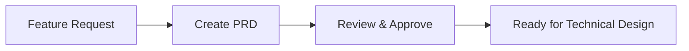
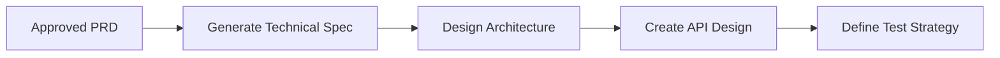
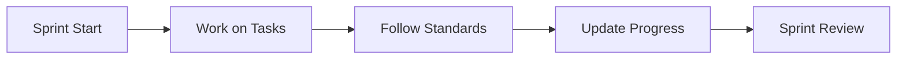

# Documentation Overview

This directory contains comprehensive documentation for the {{PROJECT_NAME}} project, following modern software development best practices (2024-2025).

## Documentation Structure

```
docs/
├── README.md          # This file
├── prd/              # Product Requirements Documents
│   ├── features/     # Feature-specific PRDs
│   └── assets/       # Supporting materials
├── tasks/            # Task Management System
│   ├── features/     # Task breakdowns by feature
│   └── tracking/     # Progress tracking
└── technical/        # Technical Documentation
    ├── architecture/ # Technical Architecture Documents
    ├── standards/    # Development standards
    ├── infrastructure/ # Deployment configurations
    ├── testing/      # Test strategies
    ├── security/     # Security requirements
    ├── api/          # API documentation
    ├── operations/   # Monitoring and ops
    └── setup/        # Developer environment

.framework/           # Framework resources (templates, prompts, guides)
├── templates/        # All reusable templates
├── prompts/          # All AI prompts
└── guides/           # Framework documentation
```

## Workflow Overview

### 1. Feature Planning (PRD)


**Quick Start:**
```bash
@claude Create a PRD for [feature] using .framework/prompts/prd/new-feature-prd.md
```

### 2. Technical Design


**Quick Start:**
```bash
@claude Analyze PRD at [path] and create technical specifications
@claude Design API for [feature] following our standards
```

### 3. Task Generation


**Quick Start:**
```bash
@claude Analyze PRD at docs/prd/features/[category]/[feature]-prd.md 
and create tasks using .framework/prompts/tasks/prd-to-tasks.md
```

### 4. Implementation & Tracking


**Quick Start:**
```bash
@claude Show current sprint status
@claude Mark task T1.1.1 as complete
```

## Key Documents

### PRD System
- [PRD Guide](.framework/guides/system-guides/prd-guide.md) - Complete guide to creating and managing PRDs
- [PRD Template](.framework/templates/prd/prd-template.md) - Standard PRD structure
- [PRD Quick Reference](.framework/guides/system-guides/prd-quick-reference.md) - Common PRD commands

### Technical System
- [Technical Guide](.framework/guides/system-guides/technical-guide.md) - Complete guide to technical documentation
- [TAD Template](.framework/templates/technical/tad-template.md) - Technical Architecture Document template
- [API Template](.framework/templates/technical/api-design-template.md) - API design template
- [Technical Quick Reference](.framework/guides/system-guides/technical-quick-reference.md) - Common technical commands

### Task System
- [Task Guide](.framework/guides/system-guides/tasks-guide.md) - Complete guide to task management
- [Task Template](.framework/templates/tasks/task-breakdown-template.md) - Standard task structure
- [Task Quick Reference](.framework/guides/system-guides/tasks-quick-reference.md) - Common task commands

### Examples
- [Example Feature PRD](prd/features/core/example-feature-prd.md)
- [Example Feature Tasks](tasks/features/core/example-feature-tasks.md)

## Best Practices

### For PRDs
1. **Problem First**: Always start with clear problem definition
2. **Measurable Success**: Define specific, measurable metrics
3. **User Focus**: Include user personas and use cases
4. **Living Document**: Update as you learn

### For Technical Documentation
1. **Architecture First**: Document key design decisions early
2. **Standards Compliance**: Follow established coding and security standards
3. **API Contracts**: Define clear interfaces before implementation
4. **Test Coverage**: Minimum 80% test coverage requirement

### For Tasks
1. **Small & Specific**: Tasks should be 1-2 days max
2. **Clear Dependencies**: Map task relationships
3. **Definition of Done**: Each task needs acceptance criteria
4. **Regular Updates**: Update status at least daily

## Integration with Development

### Git Workflow
```bash
# Reference tasks in commits
git commit -m "[T1.1.1] Implement SSH tunnel connection

- Added ssh2 library integration
- Basic tunnel establishment working

Task: T1.1.1 (Complete)
Time: 4h (Est: 3h)"
```

### PR Templates
Reference both PRD and tasks in pull requests for full traceability.

## Getting Help

### With Claude
```bash
# PRD help
@claude How do I create a PRD for [feature]?

# Task help  
@claude Help me break down this PRD into tasks

# Progress help
@claude What's the status of [feature] implementation?
```

### Quick Links
- [Creating Your First PRD](.framework/prompts/prd/new-feature-prd.md)
- [Generating Tasks from PRD](.framework/prompts/tasks/prd-to-tasks.md)
- [Tracking Sprint Progress](tasks/tracking/README.md)

## Metrics & Reporting

Track project health through:
- PRD completion rate
- Task velocity trends
- Sprint burndown charts
- Feature delivery timeline

See [Task Metrics](tasks/tracking/metrics.md) for details.

---

This documentation system ensures:
- **Alignment**: Everyone understands what we're building and why
- **Visibility**: Clear progress tracking and status
- **Quality**: Structured approach to feature development
- **Efficiency**: Reusable templates and AI assistance