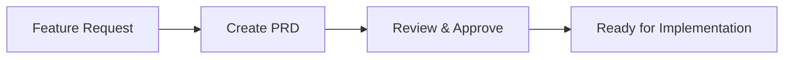
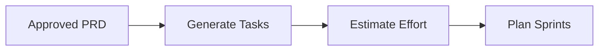
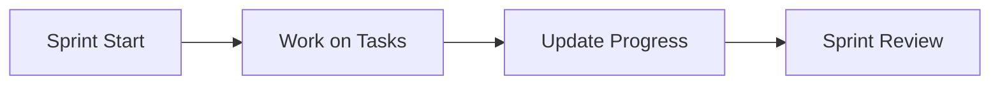

# Documentation Overview

This directory contains comprehensive documentation for the Nexus MCP Research MongoDB Server project, following modern software development best practices (2024-2025).

## Documentation Structure

```
docs/
├── README.md          # This file
├── prd/              # Product Requirements Documents
│   ├── features/     # Feature-specific PRDs
│   ├── templates/    # PRD templates
│   └── prompts/      # AI prompts for PRD generation
└── tasks/            # Task Management System
    ├── features/     # Task breakdowns by feature
    ├── templates/    # Task templates
    ├── prompts/      # AI prompts for task generation
    └── tracking/     # Progress tracking
```

## Workflow Overview

### 1. Feature Planning (PRD)


**Quick Start:**
```bash
@claude Create a PRD for [feature] using docs/prd/prompts/new-feature-prd.md
```

### 2. Task Generation


**Quick Start:**
```bash
@claude Analyze PRD at docs/prd/features/[category]/[feature]-prd.md 
and create tasks using docs/tasks/prompts/prd-to-tasks.md
```

### 3. Implementation & Tracking


**Quick Start:**
```bash
@claude Show current sprint status
@claude Mark task T1.1.1 as complete
```

## Key Documents

### PRD System
- [PRD Guide](prd/README.md) - Complete guide to creating and managing PRDs
- [PRD Template](prd/templates/prd-template.md) - Standard PRD structure
- [PRD Quick Reference](prd/QUICK_REFERENCE.md) - Common PRD commands

### Task System
- [Task Guide](tasks/README.md) - Complete guide to task management
- [Task Template](tasks/templates/task-breakdown-template.md) - Standard task structure
- [Task Quick Reference](tasks/QUICK_REFERENCE.md) - Common task commands

### Examples
- [MongoDB Connection Manager PRD](prd/features/core/mongodb-connection-manager-prd.md)
- [MongoDB Connection Manager Tasks](tasks/features/core/mongodb-connection-manager-tasks.md)

## Best Practices

### For PRDs
1. **Problem First**: Always start with clear problem definition
2. **Measurable Success**: Define specific, measurable metrics
3. **User Focus**: Include user personas and use cases
4. **Living Document**: Update as you learn

### For Tasks
1. **Small & Specific**: Tasks should be 1-2 days max
2. **Clear Dependencies**: Map task relationships
3. **Definition of Done**: Each task needs acceptance criteria
4. **Regular Updates**: Update status at least daily

## Integration with Development

### Git Workflow
```bash
# Reference tasks in commits
git commit -m "[T1.1.1] Implement SSH tunnel connection

- Added ssh2 library integration
- Basic tunnel establishment working

Task: T1.1.1 (Complete)
Time: 4h (Est: 3h)"
```

### PR Templates
Reference both PRD and tasks in pull requests for full traceability.

## Getting Help

### With Claude
```bash
# PRD help
@claude How do I create a PRD for [feature]?

# Task help  
@claude Help me break down this PRD into tasks

# Progress help
@claude What's the status of [feature] implementation?
```

### Quick Links
- [Creating Your First PRD](prd/prompts/new-feature-prd.md)
- [Generating Tasks from PRD](tasks/prompts/prd-to-tasks.md)
- [Tracking Sprint Progress](tasks/tracking/README.md)

## Metrics & Reporting

Track project health through:
- PRD completion rate
- Task velocity trends
- Sprint burndown charts
- Feature delivery timeline

See [Task Metrics](tasks/tracking/metrics.md) for details.

---

This documentation system ensures:
- **Alignment**: Everyone understands what we're building and why
- **Visibility**: Clear progress tracking and status
- **Quality**: Structured approach to feature development
- **Efficiency**: Reusable templates and AI assistance