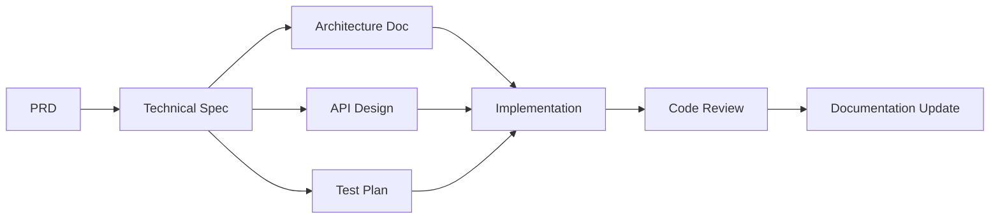

# Technical Documentation System

This directory contains comprehensive technical documentation for the Nexus MCP MongoDB integration project. It complements the Product Requirements Documentation (PRD) by providing detailed technical specifications, architecture decisions, and implementation guidelines.

## Overview

The technical documentation system serves as the bridge between product requirements and code implementation. It provides:

- **Architecture Documentation**: System design, component interactions, and technical decisions
- **Development Standards**: Coding conventions, best practices, and quality guidelines
- **Infrastructure Specifications**: Deployment configurations, environment setup, and operational requirements
- **Testing Strategies**: Test plans, coverage requirements, and quality assurance processes
- **Security Guidelines**: Authentication, authorization, and data protection requirements
- **API Documentation**: Interface specifications, data models, and integration patterns
- **Operational Procedures**: Monitoring, logging, and maintenance guidelines
- **Setup Instructions**: Developer environment configuration and onboarding

## Directory Structure

```
docs/technical/
├── README.md                 # This file
├── QUICK_REFERENCE.md       # Quick reference for common technical tasks
├── architecture/            # Technical Architecture Documents (TADs)
├── standards/              # Development standards and conventions
├── infrastructure/         # Docker, Kubernetes, deployment configs
├── testing/               # Test strategies and specifications
├── security/              # Security requirements and guidelines
├── api/                   # API design and documentation
├── operations/            # Monitoring, logging, and maintenance
├── setup/                 # Developer environment setup guides
├── templates/             # Reusable documentation templates
└── prompts/              # AI prompts for generating technical docs
```

## How to Use This System

### 1. Starting a New Feature

When beginning implementation of a feature with an existing PRD:

1. **Generate Technical Specifications**
   ```
   @claude analyze PRD at [path] and create technical specifications
   ```

2. **Create Architecture Documentation**
   - Use `templates/tad-template.md` for new components
   - Document key design decisions and trade-offs
   - Include diagrams when necessary

3. **Define API Contracts**
   - Use `templates/api-design-template.md`
   - Specify request/response formats
   - Document error handling

4. **Plan Testing Strategy**
   - Use `templates/test-specification-template.md`
   - Define unit, integration, and e2e test requirements
   - Specify coverage targets

### 2. Documentation Workflow



### 3. Best Practices

1. **Keep Documentation Current**
   - Update technical docs alongside code changes
   - Review documentation during code reviews
   - Archive outdated documentation

2. **Use Templates**
   - Start with provided templates
   - Customize as needed for specific requirements
   - Maintain consistency across documentation

3. **Link to Related Documents**
   - Always reference the source PRD
   - Link to related technical documents
   - Include references to implemented code

4. **Version Control**
   - Track major changes in documentation
   - Use semantic versioning for API specs
   - Document breaking changes prominently

## Document Types

### Technical Architecture Documents (TADs)

Located in `architecture/`, TADs provide:
- System design overview
- Component interactions
- Technology choices and rationale
- Scalability considerations
- Performance requirements

### API Design Documents

Located in `api/`, API docs include:
- Endpoint specifications
- Request/response schemas
- Authentication requirements
- Rate limiting policies
- Versioning strategy

### Test Specifications

Located in `testing/`, test docs contain:
- Test strategy overview
- Coverage requirements
- Test data specifications
- Performance benchmarks
- Security test scenarios

### Infrastructure Specifications

Located in `infrastructure/`, infra docs detail:
- Deployment architecture
- Container configurations
- Environment variables
- Resource requirements
- Scaling policies

## Quick Commands

### Generate Technical Documentation
```
# From PRD to technical spec
@claude analyze PRD at docs/prd/features/[feature]/[name]-prd.md and create technical specifications

# Create test plan
@claude generate test plan for [feature] based on technical spec

# Design API
@claude design API for [feature] following our standards
```

### Update Documentation
```
# Update architecture after implementation
@claude update TAD at docs/technical/architecture/[name]-tad.md with implementation details

# Document API changes
@claude update API documentation with new endpoints
```

### Review Documentation
```
# Check documentation completeness
@claude review technical documentation for [feature]

# Validate against implementation
@claude verify technical docs match current implementation
```

## Integration with Other Systems

### PRD System
- Technical docs reference specific PRDs
- Success metrics from PRDs inform test specifications
- User stories guide API design

### Task Management
- Technical specifications break down into implementation tasks
- Documentation tasks included in sprint planning
- Technical debt tracked as tasks

### Code Repository
- Technical docs link to implementation files
- Architecture decisions documented in ADRs
- API specs generate code stubs

## Documentation Standards

1. **Clarity**: Write for developers who are new to the project
2. **Completeness**: Include all necessary information for implementation
3. **Accuracy**: Keep documentation synchronized with code
4. **Accessibility**: Use clear headings and consistent formatting
5. **Searchability**: Use descriptive file names and include keywords

## Getting Started

1. Review existing PRDs in `docs/prd/features/`
2. Use prompts in `prompts/` to generate initial documentation
3. Customize templates from `templates/` for your needs
4. Store documentation in appropriate subdirectories
5. Link documentation in implementation pull requests

For quick reference on common tasks, see [QUICK_REFERENCE.md](./QUICK_REFERENCE.md).