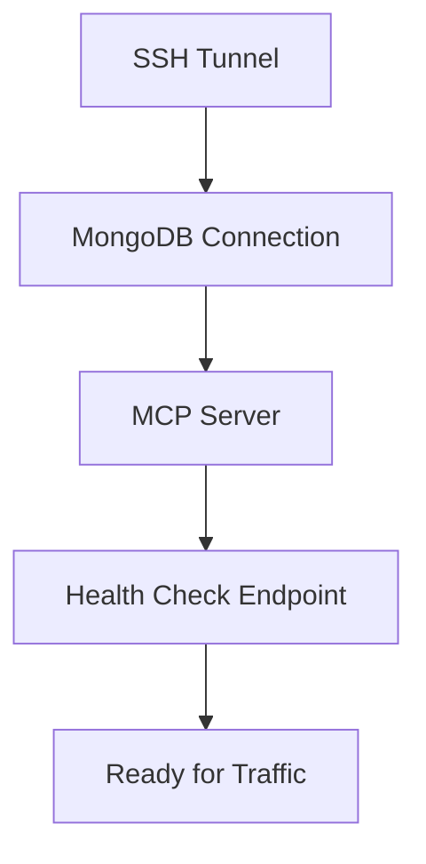

# Deployment Architecture

## Overview

This document outlines the deployment architecture for the Nexus MCP server, including container orchestration strategies, service dependencies, and scaling approaches.

## Container Orchestration Strategy

### Development Environment (Docker Compose)

```yaml
# docker-compose.yml
version: '3.8'

services:
  nexus-mcp:
    build:
      context: .
      dockerfile: Dockerfile
    container_name: nexus-mcp-server
    ports:
      - "3000:3000"
    environment:
      - NODE_ENV=development
      - MCP_PORT=3000
      - SSH_TUNNEL_HOST=${SSH_TUNNEL_HOST}
      - SSH_TUNNEL_PORT=${SSH_TUNNEL_PORT}
      - MONGO_URI=${MONGO_URI}
    volumes:
      - ./src:/app/src
      - ./config:/app/config
    depends_on:
      - ssh-tunnel
    healthcheck:
      test: ["CMD", "curl", "-f", "http://localhost:3000/health"]
      interval: 30s
      timeout: 10s
      retries: 3
      start_period: 40s
    networks:
      - nexus-network

  ssh-tunnel:
    build:
      context: ./docker/ssh-tunnel
      dockerfile: Dockerfile
    container_name: nexus-ssh-tunnel
    environment:
      - SSH_HOST=${SSH_HOST}
      - SSH_PORT=${SSH_PORT}
      - SSH_USER=${SSH_USER}
      - LOCAL_PORT=27017
      - REMOTE_HOST=${MONGO_HOST}
      - REMOTE_PORT=${MONGO_PORT}
    volumes:
      - ~/.ssh/id_rsa:/root/.ssh/id_rsa:ro
    networks:
      - nexus-network
    restart: unless-stopped

networks:
  nexus-network:
    driver: bridge
```

### Production Environment (Kubernetes)

```yaml
# k8s/deployment.yaml
apiVersion: apps/v1
kind: Deployment
metadata:
  name: nexus-mcp
  namespace: nexus
  labels:
    app: nexus-mcp
    version: v1
spec:
  replicas: 3
  selector:
    matchLabels:
      app: nexus-mcp
  template:
    metadata:
      labels:
        app: nexus-mcp
        version: v1
    spec:
      containers:
      - name: nexus-mcp
        image: nexus-mcp:latest
        ports:
        - containerPort: 3000
          name: http
        env:
        - name: NODE_ENV
          value: "production"
        - name: MCP_PORT
          value: "3000"
        - name: SSH_TUNNEL_HOST
          valueFrom:
            secretKeyRef:
              name: nexus-secrets
              key: ssh-tunnel-host
        - name: MONGO_URI
          valueFrom:
            secretKeyRef:
              name: nexus-secrets
              key: mongo-uri
        resources:
          requests:
            memory: "256Mi"
            cpu: "250m"
          limits:
            memory: "512Mi"
            cpu: "500m"
        livenessProbe:
          httpGet:
            path: /health
            port: 3000
          initialDelaySeconds: 30
          periodSeconds: 10
        readinessProbe:
          httpGet:
            path: /ready
            port: 3000
          initialDelaySeconds: 5
          periodSeconds: 5
      - name: ssh-tunnel-sidecar
        image: nexus-ssh-tunnel:latest
        env:
        - name: SSH_HOST
          valueFrom:
            secretKeyRef:
              name: nexus-secrets
              key: ssh-host
        securityContext:
          runAsNonRoot: true
          runAsUser: 1000
```

## Service Dependencies and Startup Order

### Dependency Graph



### Startup Sequence

1. **SSH Tunnel Initialization** (0-10s)
   - Establish SSH connection
   - Create port forwarding
   - Verify tunnel stability

2. **MongoDB Connection** (10-20s)
   - Test connection through tunnel
   - Verify authentication
   - Check replica set status

3. **MCP Server Bootstrap** (20-30s)
   - Load configuration
   - Initialize connection pools
   - Register MCP handlers

4. **Health Check Activation** (30s+)
   - Enable health endpoint
   - Start accepting traffic

## Health Checks and Readiness Probes

### Health Check Implementation

```javascript
// src/health/healthCheck.js
const healthCheck = {
  async checkMongoDB() {
    try {
      await mongoClient.db().admin().ping();
      return { status: 'healthy', latency: Date.now() - start };
    } catch (error) {
      return { status: 'unhealthy', error: error.message };
    }
  },

  async checkSSHTunnel() {
    try {
      const socket = new net.Socket();
      await new Promise((resolve, reject) => {
        socket.connect(27017, 'localhost', resolve);
        socket.on('error', reject);
      });
      socket.destroy();
      return { status: 'healthy' };
    } catch (error) {
      return { status: 'unhealthy', error: error.message };
    }
  },

  async getOverallHealth() {
    const checks = await Promise.all([
      this.checkMongoDB(),
      this.checkSSHTunnel()
    ]);
    
    const healthy = checks.every(check => check.status === 'healthy');
    return {
      status: healthy ? 'healthy' : 'unhealthy',
      checks: {
        mongodb: checks[0],
        sshTunnel: checks[1]
      },
      timestamp: new Date().toISOString()
    };
  }
};
```

### Readiness Probe Configuration

```yaml
# Kubernetes readiness probe
readinessProbe:
  httpGet:
    path: /ready
    port: 3000
  initialDelaySeconds: 5
  periodSeconds: 5
  successThreshold: 1
  failureThreshold: 3

# Docker Compose health check
healthcheck:
  test: ["CMD-SHELL", "curl -f http://localhost:3000/health || exit 1"]
  interval: 30s
  timeout: 10s
  retries: 3
  start_period: 40s
```

## Resource Allocation Guidelines

### Container Resource Limits

| Component | CPU Request | CPU Limit | Memory Request | Memory Limit |
|-----------|-------------|-----------|----------------|--------------|
| MCP Server | 250m | 500m | 256Mi | 512Mi |
| SSH Tunnel | 100m | 200m | 64Mi | 128Mi |
| Nginx Proxy | 100m | 200m | 64Mi | 128Mi |

### Resource Calculation Formula

```
Total Resources = (Base Resource × Number of Replicas) × 1.2 (20% overhead)

Example for 3 replicas:
- CPU: (250m + 100m) × 3 × 1.2 = 1260m ≈ 1.3 cores
- Memory: (256Mi + 64Mi) × 3 × 1.2 = 1152Mi ≈ 1.2GB
```

## Scaling Strategies

### Horizontal Scaling (HPA)

```yaml
# k8s/hpa.yaml
apiVersion: autoscaling/v2
kind: HorizontalPodAutoscaler
metadata:
  name: nexus-mcp-hpa
  namespace: nexus
spec:
  scaleTargetRef:
    apiVersion: apps/v1
    kind: Deployment
    name: nexus-mcp
  minReplicas: 2
  maxReplicas: 10
  metrics:
  - type: Resource
    resource:
      name: cpu
      target:
        type: Utilization
        averageUtilization: 70
  - type: Resource
    resource:
      name: memory
      target:
        type: Utilization
        averageUtilization: 80
  - type: Pods
    pods:
      metric:
        name: mcp_active_connections
      target:
        type: AverageValue
        averageValue: "30"
```

### Vertical Scaling Guidelines

1. **Monitor Metrics**
   - CPU usage patterns
   - Memory consumption
   - Connection pool utilization

2. **Scaling Triggers**
   - CPU > 80% for 5 minutes
   - Memory > 85% consistently
   - Response time > 2s p95

3. **Scaling Steps**
   ```
   Small:  250m CPU, 256Mi Memory
   Medium: 500m CPU, 512Mi Memory
   Large:  1000m CPU, 1Gi Memory
   XLarge: 2000m CPU, 2Gi Memory
   ```

## Load Balancing Configuration

### Nginx Ingress Configuration

```yaml
# k8s/ingress.yaml
apiVersion: networking.k8s.io/v1
kind: Ingress
metadata:
  name: nexus-mcp-ingress
  namespace: nexus
  annotations:
    nginx.ingress.kubernetes.io/load-balance: "round_robin"
    nginx.ingress.kubernetes.io/upstream-keepalive-connections: "32"
    nginx.ingress.kubernetes.io/upstream-keepalive-timeout: "60"
    nginx.ingress.kubernetes.io/proxy-connect-timeout: "30"
    nginx.ingress.kubernetes.io/proxy-send-timeout: "120"
    nginx.ingress.kubernetes.io/proxy-read-timeout: "120"
spec:
  ingressClassName: nginx
  tls:
  - hosts:
    - mcp.nexus.example.com
    secretName: nexus-tls
  rules:
  - host: mcp.nexus.example.com
    http:
      paths:
      - path: /
        pathType: Prefix
        backend:
          service:
            name: nexus-mcp-service
            port:
              number: 3000
```

### Load Balancer Service

```yaml
# k8s/service.yaml
apiVersion: v1
kind: Service
metadata:
  name: nexus-mcp-service
  namespace: nexus
  annotations:
    service.beta.kubernetes.io/aws-load-balancer-type: "nlb"
    service.beta.kubernetes.io/aws-load-balancer-cross-zone-load-balancing-enabled: "true"
spec:
  type: LoadBalancer
  selector:
    app: nexus-mcp
  ports:
  - port: 3000
    targetPort: 3000
    protocol: TCP
  sessionAffinity: ClientIP
  sessionAffinityConfig:
    clientIP:
      timeoutSeconds: 10800
```

## Service Mesh Considerations

### Istio Configuration

```yaml
# istio/virtual-service.yaml
apiVersion: networking.istio.io/v1beta1
kind: VirtualService
metadata:
  name: nexus-mcp-vs
  namespace: nexus
spec:
  hosts:
  - nexus-mcp-service
  http:
  - match:
    - headers:
        x-version:
          exact: v2
    route:
    - destination:
        host: nexus-mcp-service
        subset: v2
      weight: 100
  - route:
    - destination:
        host: nexus-mcp-service
        subset: v1
      weight: 90
    - destination:
        host: nexus-mcp-service
        subset: v2
      weight: 10
```

### Circuit Breaker Configuration

```yaml
# istio/destination-rule.yaml
apiVersion: networking.istio.io/v1beta1
kind: DestinationRule
metadata:
  name: nexus-mcp-dr
  namespace: nexus
spec:
  host: nexus-mcp-service
  trafficPolicy:
    connectionPool:
      tcp:
        maxConnections: 100
      http:
        http1MaxPendingRequests: 50
        http2MaxRequests: 100
        maxRequestsPerConnection: 2
    outlierDetection:
      consecutiveErrors: 5
      interval: 30s
      baseEjectionTime: 30s
      maxEjectionPercent: 50
      minHealthPercent: 30
  subsets:
  - name: v1
    labels:
      version: v1
  - name: v2
    labels:
      version: v2
```

## Monitoring and Observability

### Prometheus Metrics

```yaml
# k8s/servicemonitor.yaml
apiVersion: monitoring.coreos.com/v1
kind: ServiceMonitor
metadata:
  name: nexus-mcp-metrics
  namespace: nexus
spec:
  selector:
    matchLabels:
      app: nexus-mcp
  endpoints:
  - port: metrics
    interval: 30s
    path: /metrics
```

### Key Metrics to Monitor

1. **System Metrics**
   - CPU utilization
   - Memory usage
   - Network I/O
   - Disk I/O

2. **Application Metrics**
   - Request rate
   - Response time
   - Error rate
   - Active connections

3. **MongoDB Metrics**
   - Connection pool size
   - Query latency
   - Operation throughput
   - SSH tunnel stability

## Disaster Recovery

### Backup Strategy

```bash
#!/bin/bash
# backup-script.sh
BACKUP_DATE=$(date +%Y%m%d_%H%M%S)
NAMESPACE="nexus"

# Backup Kubernetes resources
kubectl get all,cm,secret -n $NAMESPACE -o yaml > nexus-k8s-backup-$BACKUP_DATE.yaml

# Backup persistent volumes
kubectl get pv -o yaml > nexus-pv-backup-$BACKUP_DATE.yaml

# Store in S3
aws s3 cp nexus-k8s-backup-$BACKUP_DATE.yaml s3://nexus-backups/k8s/
aws s3 cp nexus-pv-backup-$BACKUP_DATE.yaml s3://nexus-backups/pv/
```

### Recovery Procedure

1. **Service Recovery**
   ```bash
   kubectl apply -f nexus-k8s-backup-$BACKUP_DATE.yaml
   ```

2. **Data Recovery**
   - Restore PVs from backup
   - Verify MongoDB connectivity
   - Test SSH tunnel functionality

3. **Validation**
   - Check all pods are running
   - Verify health endpoints
   - Test MCP functionality