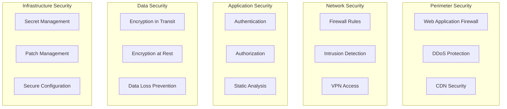

# Security Setup Guide

This document provides comprehensive security guidelines and implementation patterns that can be applied to any type of application or infrastructure.

## Security Architecture Overview

### Defense in Depth Model


## Authentication and Authorization

### Multi-Factor Authentication (MFA)
```typescript
// MFA Implementation Pattern
interface MFAProvider {
  generateSecret(): string;
  generateQRCode(secret: string, user: string): Promise<string>;
  verifyToken(secret: string, token: string): boolean;
}

class AuthenticationService {
  async authenticateUser(credentials: UserCredentials): Promise<AuthResult> {
    // Step 1: Verify username and password
    const user = await this.verifyCredentials(credentials);
    if (!user) {
      throw new AuthenticationError('Invalid credentials');
    }
    
    // Step 2: Check if MFA is enabled
    if (user.mfaEnabled) {
      return {
        success: false,
        requiresMFA: true,
        sessionToken: this.generateTempToken(user.id)
      };
    }
    
    // Step 3: Generate session
    return this.createSession(user);
  }
  
  async verifyMFA(sessionToken: string, mfaCode: string): Promise<AuthResult> {
    const userId = this.validateTempToken(sessionToken);
    const user = await this.getUser(userId);
    
    if (!this.mfaProvider.verifyToken(user.mfaSecret, mfaCode)) {
      throw new AuthenticationError('Invalid MFA code');
    }
    
    return this.createSession(user);
  }
}
```

### OAuth 2.0 / OpenID Connect
```javascript
// OAuth 2.0 Configuration
const oauthConfig = {
  providers: {
    google: {
      clientId: process.env.GOOGLE_CLIENT_ID,
      clientSecret: process.env.GOOGLE_CLIENT_SECRET,
      authorizationURL: 'https://accounts.google.com/o/oauth2/v2/auth',
      tokenURL: 'https://oauth2.googleapis.com/token',
      userInfoURL: 'https://www.googleapis.com/oauth2/v2/userinfo',
      callbackURL: 'https://app.example.com/auth/google/callback',
      scope: ['openid', 'email', 'profile']
    },
    github: {
      clientId: process.env.GITHUB_CLIENT_ID,
      clientSecret: process.env.GITHUB_CLIENT_SECRET,
      authorizationURL: 'https://github.com/login/oauth/authorize',
      tokenURL: 'https://github.com/login/oauth/access_token',
      userInfoURL: 'https://api.github.com/user',
      callbackURL: 'https://app.example.com/auth/github/callback',
      scope: ['user:email']
    }
  }
};

// OAuth Flow Implementation
class OAuthService {
  getAuthorizationUrl(provider: string, state: string): string {
    const config = oauthConfig.providers[provider];
    const params = new URLSearchParams({
      client_id: config.clientId,
      redirect_uri: config.callbackURL,
      response_type: 'code',
      scope: config.scope.join(' '),
      state: state
    });
    
    return `${config.authorizationURL}?${params}`;
  }
  
  async exchangeCodeForToken(provider: string, code: string): Promise<TokenResponse> {
    const config = oauthConfig.providers[provider];
    
    const response = await fetch(config.tokenURL, {
      method: 'POST',
      headers: {
        'Content-Type': 'application/x-www-form-urlencoded'
      },
      body: new URLSearchParams({
        grant_type: 'authorization_code',
        code: code,
        client_id: config.clientId,
        client_secret: config.clientSecret,
        redirect_uri: config.callbackURL
      })
    });
    
    return response.json();
  }
}
```

### JWT Token Management
```typescript
import jwt from 'jsonwebtoken';
import { randomBytes } from 'crypto';

interface TokenPair {
  accessToken: string;
  refreshToken: string;
}

class TokenService {
  private readonly accessTokenSecret = process.env.JWT_ACCESS_SECRET;
  private readonly refreshTokenSecret = process.env.JWT_REFRESH_SECRET;
  private readonly accessTokenExpiry = '15m';
  private readonly refreshTokenExpiry = '7d';
  
  generateTokenPair(userId: string, claims: any = {}): TokenPair {
    const jti = randomBytes(16).toString('hex');
    
    const accessToken = jwt.sign(
      {
        sub: userId,
        jti,
        type: 'access',
        ...claims
      },
      this.accessTokenSecret,
      {
        expiresIn: this.accessTokenExpiry,
        issuer: 'app.example.com',
        audience: 'api.example.com'
      }
    );
    
    const refreshToken = jwt.sign(
      {
        sub: userId,
        jti,
        type: 'refresh'
      },
      this.refreshTokenSecret,
      {
        expiresIn: this.refreshTokenExpiry,
        issuer: 'app.example.com'
      }
    );
    
    return { accessToken, refreshToken };
  }
  
  verifyAccessToken(token: string): any {
    try {
      return jwt.verify(token, this.accessTokenSecret, {
        issuer: 'app.example.com',
        audience: 'api.example.com'
      });
    } catch (error) {
      throw new AuthenticationError('Invalid access token');
    }
  }
  
  async refreshTokens(refreshToken: string): Promise<TokenPair> {
    try {
      const payload = jwt.verify(refreshToken, this.refreshTokenSecret);
      
      // Check if token is blacklisted
      if (await this.isTokenBlacklisted(payload.jti)) {
        throw new AuthenticationError('Token has been revoked');
      }
      
      // Blacklist old refresh token
      await this.blacklistToken(payload.jti, payload.exp);
      
      // Generate new token pair
      return this.generateTokenPair(payload.sub);
    } catch (error) {
      throw new AuthenticationError('Invalid refresh token');
    }
  }
}
```

## Role-Based Access Control (RBAC)

### RBAC Implementation
```typescript
// Permission and Role Definitions
interface Permission {
  resource: string;
  action: string;
  scope?: string;
}

interface Role {
  id: string;
  name: string;
  permissions: Permission[];
}

// RBAC Service
class RBACService {
  private roles: Map<string, Role> = new Map([
    ['admin', {
      id: 'admin',
      name: 'Administrator',
      permissions: [
        { resource: '*', action: '*' }
      ]
    }],
    ['editor', {
      id: 'editor',
      name: 'Editor',
      permissions: [
        { resource: 'content', action: 'create' },
        { resource: 'content', action: 'read' },
        { resource: 'content', action: 'update' },
        { resource: 'content', action: 'delete', scope: 'own' }
      ]
    }],
    ['viewer', {
      id: 'viewer',
      name: 'Viewer',
      permissions: [
        { resource: 'content', action: 'read' }
      ]
    }]
  ]);
  
  hasPermission(
    userRoles: string[],
    resource: string,
    action: string,
    context?: any
  ): boolean {
    for (const roleId of userRoles) {
      const role = this.roles.get(roleId);
      if (!role) continue;
      
      for (const permission of role.permissions) {
        if (this.matchesPermission(permission, resource, action, context)) {
          return true;
        }
      }
    }
    
    return false;
  }
  
  private matchesPermission(
    permission: Permission,
    resource: string,
    action: string,
    context?: any
  ): boolean {
    // Wildcard matching
    if (permission.resource === '*' || permission.resource === resource) {
      if (permission.action === '*' || permission.action === action) {
        // Check scope if defined
        if (permission.scope === 'own' && context) {
          return context.ownerId === context.userId;
        }
        return true;
      }
    }
    return false;
  }
}

// Authorization Middleware
function authorize(resource: string, action: string) {
  return async (req: Request, res: Response, next: NextFunction) => {
    const user = req.user;
    const rbac = new RBACService();
    
    const context = {
      userId: user.id,
      ownerId: req.params.ownerId || req.body.ownerId
    };
    
    if (!rbac.hasPermission(user.roles, resource, action, context)) {
      return res.status(403).json({
        error: 'Forbidden',
        message: 'Insufficient permissions'
      });
    }
    
    next();
  };
}
```

## Network Security

### Firewall Configuration
```yaml
# iptables rules template
#!/bin/bash

# Default policies
iptables -P INPUT DROP
iptables -P FORWARD DROP
iptables -P OUTPUT ACCEPT

# Allow loopback
iptables -A INPUT -i lo -j ACCEPT
iptables -A OUTPUT -o lo -j ACCEPT

# Allow established connections
iptables -A INPUT -m state --state ESTABLISHED,RELATED -j ACCEPT

# Allow SSH (restrict source IPs)
iptables -A INPUT -p tcp --dport 22 -s 10.0.0.0/8 -j ACCEPT

# Allow HTTP/HTTPS
iptables -A INPUT -p tcp --dport 80 -j ACCEPT
iptables -A INPUT -p tcp --dport 443 -j ACCEPT

# Rate limiting
iptables -A INPUT -p tcp --dport 443 -m state --state NEW -m limit --limit 50/second --limit-burst 100 -j ACCEPT
iptables -A INPUT -p tcp --dport 443 -m state --state NEW -j DROP

# DDoS protection
iptables -A INPUT -p tcp --tcp-flags ALL NONE -j DROP
iptables -A INPUT -p tcp --tcp-flags SYN,FIN SYN,FIN -j DROP
iptables -A INPUT -p tcp --tcp-flags SYN,RST SYN,RST -j DROP

# Log dropped packets
iptables -A INPUT -m limit --limit 5/min -j LOG --log-prefix "iptables dropped: " --log-level 7

# Save rules
iptables-save > /etc/iptables/rules.v4
```

### VPN Configuration
```yaml
# WireGuard VPN Configuration
[Interface]
Address = 10.0.0.1/24
PrivateKey = <server-private-key>
ListenPort = 51820
PostUp = iptables -A FORWARD -i %i -j ACCEPT; iptables -t nat -A POSTROUTING -o eth0 -j MASQUERADE
PostDown = iptables -D FORWARD -i %i -j ACCEPT; iptables -t nat -D POSTROUTING -o eth0 -j MASQUERADE

# Peer configuration template
[Peer]
PublicKey = <client-public-key>
PresharedKey = <preshared-key>
AllowedIPs = 10.0.0.2/32
PersistentKeepalive = 25
```

## Data Protection

### Encryption at Rest
```typescript
import crypto from 'crypto';

class EncryptionService {
  private algorithm = 'aes-256-gcm';
  private keyDerivationIterations = 100000;
  
  // Derive encryption key from master key
  private deriveKey(masterKey: string, salt: Buffer): Buffer {
    return crypto.pbkdf2Sync(
      masterKey,
      salt,
      this.keyDerivationIterations,
      32,
      'sha256'
    );
  }
  
  encrypt(plaintext: string, masterKey: string): EncryptedData {
    const salt = crypto.randomBytes(32);
    const key = this.deriveKey(masterKey, salt);
    const iv = crypto.randomBytes(16);
    
    const cipher = crypto.createCipheriv(this.algorithm, key, iv);
    
    let encrypted = cipher.update(plaintext, 'utf8', 'hex');
    encrypted += cipher.final('hex');
    
    const authTag = cipher.getAuthTag();
    
    return {
      encrypted,
      salt: salt.toString('hex'),
      iv: iv.toString('hex'),
      authTag: authTag.toString('hex'),
      algorithm: this.algorithm
    };
  }
  
  decrypt(encryptedData: EncryptedData, masterKey: string): string {
    const salt = Buffer.from(encryptedData.salt, 'hex');
    const key = this.deriveKey(masterKey, salt);
    const iv = Buffer.from(encryptedData.iv, 'hex');
    const authTag = Buffer.from(encryptedData.authTag, 'hex');
    
    const decipher = crypto.createDecipheriv(this.algorithm, key, iv);
    decipher.setAuthTag(authTag);
    
    let decrypted = decipher.update(encryptedData.encrypted, 'hex', 'utf8');
    decrypted += decipher.final('utf8');
    
    return decrypted;
  }
}

// Field-level encryption for sensitive data
class FieldEncryption {
  constructor(private encryptionService: EncryptionService) {}
  
  encryptObject(obj: any, fieldsToEncrypt: string[], masterKey: string): any {
    const encrypted = { ...obj };
    
    for (const field of fieldsToEncrypt) {
      if (obj[field]) {
        encrypted[field] = this.encryptionService.encrypt(
          JSON.stringify(obj[field]),
          masterKey
        );
      }
    }
    
    return encrypted;
  }
  
  decryptObject(obj: any, fieldsToDecrypt: string[], masterKey: string): any {
    const decrypted = { ...obj };
    
    for (const field of fieldsToDecrypt) {
      if (obj[field] && typeof obj[field] === 'object') {
        decrypted[field] = JSON.parse(
          this.encryptionService.decrypt(obj[field], masterKey)
        );
      }
    }
    
    return decrypted;
  }
}
```

### Encryption in Transit
```nginx
# Nginx SSL Configuration
server {
    listen 443 ssl http2;
    server_name example.com;
    
    # SSL Certificate
    ssl_certificate /etc/ssl/certs/example.com.crt;
    ssl_certificate_key /etc/ssl/private/example.com.key;
    
    # SSL Configuration
    ssl_protocols TLSv1.2 TLSv1.3;
    ssl_ciphers ECDHE-ECDSA-AES128-GCM-SHA256:ECDHE-RSA-AES128-GCM-SHA256:ECDHE-ECDSA-AES256-GCM-SHA384:ECDHE-RSA-AES256-GCM-SHA384;
    ssl_prefer_server_ciphers off;
    
    # OCSP Stapling
    ssl_stapling on;
    ssl_stapling_verify on;
    ssl_trusted_certificate /etc/ssl/certs/ca-certificates.crt;
    
    # Session Configuration
    ssl_session_timeout 1d;
    ssl_session_cache shared:SSL:10m;
    ssl_session_tickets off;
    
    # HSTS
    add_header Strict-Transport-Security "max-age=63072000; includeSubDomains; preload" always;
    
    # Additional Security Headers
    add_header X-Frame-Options "SAMEORIGIN" always;
    add_header X-Content-Type-Options "nosniff" always;
    add_header X-XSS-Protection "1; mode=block" always;
    add_header Referrer-Policy "strict-origin-when-cross-origin" always;
    add_header Content-Security-Policy "default-src 'self'; script-src 'self' 'unsafe-inline' 'unsafe-eval'; style-src 'self' 'unsafe-inline';" always;
}
```

## Secret Management

### HashiCorp Vault Integration
```typescript
import { Vault } from 'node-vault';

class SecretManager {
  private vault: Vault;
  
  constructor() {
    this.vault = new Vault({
      endpoint: process.env.VAULT_ADDR,
      token: process.env.VAULT_TOKEN
    });
  }
  
  async getSecret(path: string): Promise<any> {
    try {
      const response = await this.vault.read(path);
      return response.data;
    } catch (error) {
      console.error(`Failed to retrieve secret from ${path}:`, error);
      throw new Error('Secret retrieval failed');
    }
  }
  
  async storeSecret(path: string, data: any): Promise<void> {
    try {
      await this.vault.write(path, data);
    } catch (error) {
      console.error(`Failed to store secret at ${path}:`, error);
      throw new Error('Secret storage failed');
    }
  }
  
  async rotateSecret(path: string, generator: () => string): Promise<string> {
    const newSecret = generator();
    
    // Store new version
    await this.storeSecret(path, {
      value: newSecret,
      version: Date.now(),
      rotated_at: new Date().toISOString()
    });
    
    return newSecret;
  }
}

// Environment-specific secret loading
class ConfigManager {
  private secretManager: SecretManager;
  private cache: Map<string, any> = new Map();
  
  async loadConfig(environment: string): Promise<Config> {
    const cacheKey = `config-${environment}`;
    
    if (this.cache.has(cacheKey)) {
      return this.cache.get(cacheKey);
    }
    
    const config = {
      database: await this.secretManager.getSecret(`secret/data/${environment}/database`),
      api: await this.secretManager.getSecret(`secret/data/${environment}/api`),
      oauth: await this.secretManager.getSecret(`secret/data/${environment}/oauth`)
    };
    
    this.cache.set(cacheKey, config);
    
    // Refresh cache periodically
    setTimeout(() => this.cache.delete(cacheKey), 300000); // 5 minutes
    
    return config;
  }
}
```

### AWS Secrets Manager
```typescript
import { SecretsManagerClient, GetSecretValueCommand } from '@aws-sdk/client-secrets-manager';

class AWSSecretManager {
  private client: SecretsManagerClient;
  
  constructor() {
    this.client = new SecretsManagerClient({
      region: process.env.AWS_REGION
    });
  }
  
  async getSecret(secretName: string): Promise<any> {
    try {
      const command = new GetSecretValueCommand({
        SecretId: secretName
      });
      
      const response = await this.client.send(command);
      
      if (response.SecretString) {
        return JSON.parse(response.SecretString);
      } else if (response.SecretBinary) {
        return Buffer.from(response.SecretBinary).toString('utf-8');
      }
    } catch (error) {
      console.error(`Failed to retrieve secret ${secretName}:`, error);
      throw error;
    }
  }
}
```

## Input Validation and Sanitization

### Input Validation Framework
```typescript
import { z } from 'zod';
import DOMPurify from 'isomorphic-dompurify';

// Schema Validation
const userSchema = z.object({
  email: z.string().email(),
  password: z.string().min(8).regex(/^(?=.*[a-z])(?=.*[A-Z])(?=.*\d)(?=.*[@$!%*?&])/),
  username: z.string().min(3).max(20).regex(/^[a-zA-Z0-9_-]+$/),
  age: z.number().min(0).max(150).optional(),
  bio: z.string().max(500).optional()
});

// SQL Injection Prevention
class DatabaseService {
  async findUser(email: string): Promise<User> {
    // Use parameterized queries
    const query = 'SELECT * FROM users WHERE email = $1';
    const result = await this.db.query(query, [email]);
    return result.rows[0];
  }
  
  // For dynamic queries, use query builders
  async searchUsers(filters: UserFilters): Promise<User[]> {
    const query = this.queryBuilder
      .select('*')
      .from('users')
      .where('active', true);
    
    if (filters.name) {
      query.andWhere('name', 'ILIKE', `%${filters.name}%`);
    }
    
    if (filters.role) {
      query.andWhere('role', '=', filters.role);
    }
    
    return query.execute();
  }
}

// XSS Prevention
class ContentSanitizer {
  sanitizeHtml(html: string): string {
    return DOMPurify.sanitize(html, {
      ALLOWED_TAGS: ['p', 'br', 'strong', 'em', 'u', 'a'],
      ALLOWED_ATTR: ['href', 'target'],
      ALLOW_DATA_ATTR: false
    });
  }
  
  escapeHtml(text: string): string {
    const map: Record<string, string> = {
      '&': '&amp;',
      '<': '&lt;',
      '>': '&gt;',
      '"': '&quot;',
      "'": '&#x27;',
      '/': '&#x2F;'
    };
    
    return text.replace(/[&<>"'/]/g, (char) => map[char]);
  }
}

// File Upload Validation
class FileUploadValidator {
  private allowedMimeTypes = ['image/jpeg', 'image/png', 'image/gif', 'application/pdf'];
  private maxFileSize = 10 * 1024 * 1024; // 10MB
  
  async validateFile(file: Express.Multer.File): Promise<ValidationResult> {
    // Check file size
    if (file.size > this.maxFileSize) {
      return { valid: false, error: 'File too large' };
    }
    
    // Check MIME type
    if (!this.allowedMimeTypes.includes(file.mimetype)) {
      return { valid: false, error: 'Invalid file type' };
    }
    
    // Verify actual file content matches MIME type
    const fileType = await this.detectFileType(file.buffer);
    if (fileType !== file.mimetype) {
      return { valid: false, error: 'File type mismatch' };
    }
    
    // Scan for malware (integrate with antivirus API)
    const isSafe = await this.scanForMalware(file.buffer);
    if (!isSafe) {
      return { valid: false, error: 'File contains malware' };
    }
    
    return { valid: true };
  }
}
```

## Security Headers

### Comprehensive Security Headers
```typescript
import helmet from 'helmet';

// Express.js security headers middleware
app.use(helmet({
  contentSecurityPolicy: {
    directives: {
      defaultSrc: ["'self'"],
      scriptSrc: ["'self'", "'unsafe-inline'", "https://cdn.example.com"],
      styleSrc: ["'self'", "'unsafe-inline'", "https://fonts.googleapis.com"],
      fontSrc: ["'self'", "https://fonts.gstatic.com"],
      imgSrc: ["'self'", "data:", "https:"],
      connectSrc: ["'self'", "https://api.example.com"],
      frameSrc: ["'none'"],
      objectSrc: ["'none'"],
      upgradeInsecureRequests: []
    }
  },
  hsts: {
    maxAge: 31536000,
    includeSubDomains: true,
    preload: true
  }
}));

// Additional custom headers
app.use((req, res, next) => {
  // Permissions Policy
  res.setHeader(
    'Permissions-Policy',
    'geolocation=(), microphone=(), camera=(), payment=()'
  );
  
  // Prevent information leakage
  res.removeHeader('X-Powered-By');
  res.removeHeader('Server');
  
  // Cache control for sensitive pages
  if (req.url.includes('/admin') || req.url.includes('/api')) {
    res.setHeader('Cache-Control', 'no-store, no-cache, must-revalidate, private');
    res.setHeader('Pragma', 'no-cache');
    res.setHeader('Expires', '0');
  }
  
  next();
});
```

## Audit Logging

### Comprehensive Audit System
```typescript
interface AuditLog {
  id: string;
  timestamp: Date;
  userId: string;
  action: string;
  resource: string;
  resourceId?: string;
  ipAddress: string;
  userAgent: string;
  result: 'success' | 'failure';
  metadata?: Record<string, any>;
}

class AuditService {
  async log(event: Partial<AuditLog>): Promise<void> {
    const auditLog: AuditLog = {
      id: this.generateId(),
      timestamp: new Date(),
      result: 'success',
      ...event
    };
    
    // Store in database
    await this.db.collection('audit_logs').insertOne(auditLog);
    
    // Send to SIEM if configured
    if (this.siemEnabled) {
      await this.sendToSIEM(auditLog);
    }
    
    // Alert on suspicious activities
    await this.checkForAnomalies(auditLog);
  }
  
  private async checkForAnomalies(log: AuditLog): Promise<void> {
    // Multiple failed login attempts
    if (log.action === 'login' && log.result === 'failure') {
      const recentFailures = await this.db.collection('audit_logs').countDocuments({
        userId: log.userId,
        action: 'login',
        result: 'failure',
        timestamp: { $gte: new Date(Date.now() - 300000) } // Last 5 minutes
      });
      
      if (recentFailures >= 5) {
        await this.alertSecurityTeam('Multiple failed login attempts', log);
      }
    }
    
    // Unusual access patterns
    if (log.action === 'data_export') {
      const recentExports = await this.db.collection('audit_logs').countDocuments({
        userId: log.userId,
        action: 'data_export',
        timestamp: { $gte: new Date(Date.now() - 3600000) } // Last hour
      });
      
      if (recentExports >= 10) {
        await this.alertSecurityTeam('Excessive data exports', log);
      }
    }
  }
}

// Audit Middleware
function auditMiddleware(action: string) {
  return async (req: Request, res: Response, next: NextFunction) => {
    const auditService = new AuditService();
    
    const startTime = Date.now();
    const originalSend = res.send;
    
    res.send = function(data: any) {
      res.send = originalSend;
      
      const duration = Date.now() - startTime;
      const result = res.statusCode < 400 ? 'success' : 'failure';
      
      auditService.log({
        userId: req.user?.id || 'anonymous',
        action,
        resource: req.route?.path || req.path,
        resourceId: req.params?.id,
        ipAddress: req.ip,
        userAgent: req.get('user-agent') || '',
        result,
        metadata: {
          method: req.method,
          statusCode: res.statusCode,
          duration,
          query: req.query,
          body: req.body // Be careful with sensitive data
        }
      }).catch(console.error);
      
      return res.send(data);
    };
    
    next();
  };
}
```

## Security Monitoring

### Real-time Security Monitoring
```typescript
class SecurityMonitor {
  private thresholds = {
    loginFailures: { count: 5, window: 300000 }, // 5 failures in 5 minutes
    requestRate: { count: 1000, window: 60000 }, // 1000 requests per minute
    errorRate: { percentage: 5, window: 300000 }, // 5% error rate in 5 minutes
    suspiciousPatterns: [
      /(\.\.|\/\/|\\\\)/, // Path traversal
      /<script[^>]*>.*?<\/script>/gi, // XSS attempts
      /union.*select|select.*from|insert.*into|delete.*from/i // SQL injection
    ]
  };
  
  async monitorRequest(req: Request): Promise<SecurityAlert[]> {
    const alerts: SecurityAlert[] = [];
    
    // Check for suspicious patterns
    const requestData = JSON.stringify({
      path: req.path,
      query: req.query,
      body: req.body
    });
    
    for (const pattern of this.thresholds.suspiciousPatterns) {
      if (pattern.test(requestData)) {
        alerts.push({
          type: 'suspicious_pattern',
          severity: 'high',
          message: `Suspicious pattern detected: ${pattern}`,
          request: this.sanitizeRequest(req)
        });
      }
    }
    
    // Check rate limits
    const requestCount = await this.getRequestCount(
      req.ip,
      this.thresholds.requestRate.window
    );
    
    if (requestCount > this.thresholds.requestRate.count) {
      alerts.push({
        type: 'rate_limit_exceeded',
        severity: 'medium',
        message: `Rate limit exceeded: ${requestCount} requests`,
        ip: req.ip
      });
    }
    
    return alerts;
  }
  
  async handleAlert(alert: SecurityAlert): Promise<void> {
    // Log alert
    await this.logAlert(alert);
    
    // Take action based on severity
    switch (alert.severity) {
      case 'critical':
        await this.blockIP(alert.ip);
        await this.notifySecurityTeam(alert);
        break;
      case 'high':
        await this.temporaryBlock(alert.ip, 3600000); // 1 hour
        await this.notifySecurityTeam(alert);
        break;
      case 'medium':
        await this.rateLimit(alert.ip);
        break;
    }
  }
}
```

## Incident Response

### Incident Response Plan
```typescript
interface IncidentResponse {
  detect(): Promise<Incident[]>;
  contain(incident: Incident): Promise<void>;
  eradicate(incident: Incident): Promise<void>;
  recover(incident: Incident): Promise<void>;
  review(incident: Incident): Promise<LessonsLearned>;
}

class IncidentResponseService implements IncidentResponse {
  async detect(): Promise<Incident[]> {
    // Monitor various sources for incidents
    const incidents: Incident[] = [];
    
    // Check audit logs
    const suspiciousLogs = await this.analyzeLogs();
    incidents.push(...suspiciousLogs);
    
    // Check system metrics
    const anomalies = await this.detectAnomalies();
    incidents.push(...anomalies);
    
    // Check external threat feeds
    const threats = await this.checkThreatFeeds();
    incidents.push(...threats);
    
    return incidents;
  }
  
  async contain(incident: Incident): Promise<void> {
    // Immediate containment actions
    switch (incident.type) {
      case 'data_breach':
        await this.revokeAffectedTokens(incident);
        await this.blockCompromisedAccounts(incident);
        break;
      case 'ddos_attack':
        await this.enableDDoSProtection();
        await this.scaleInfrastructure();
        break;
      case 'malware':
        await this.isolateAffectedSystems(incident);
        await this.blockMaliciousIPs(incident);
        break;
    }
    
    // Preserve evidence
    await this.preserveEvidence(incident);
  }
  
  async eradicate(incident: Incident): Promise<void> {
    // Remove the threat
    switch (incident.type) {
      case 'malware':
        await this.removeMalware(incident);
        await this.patchVulnerabilities(incident);
        break;
      case 'unauthorized_access':
        await this.removeBackdoors(incident);
        await this.resetCredentials(incident);
        break;
    }
  }
  
  async recover(incident: Incident): Promise<void> {
    // Restore normal operations
    await this.restoreFromBackup(incident);
    await this.verifySystemIntegrity(incident);
    await this.monitorForRecurrence(incident);
  }
  
  async review(incident: Incident): Promise<LessonsLearned> {
    return {
      whatWentWell: await this.analyzeResponse(incident),
      whatCouldImprove: await this.identifyGaps(incident),
      actionItems: await this.createActionPlan(incident),
      updatedProcedures: await this.updateRunbooks(incident)
    };
  }
}
```

## Security Testing

### Automated Security Testing
```typescript
// Security test suite
describe('Security Tests', () => {
  describe('Authentication', () => {
    it('should prevent brute force attacks', async () => {
      const attempts = 10;
      const results = [];
      
      for (let i = 0; i < attempts; i++) {
        const result = await request(app)
          .post('/auth/login')
          .send({ email: 'test@example.com', password: 'wrong' });
        results.push(result.status);
      }
      
      // Should start blocking after threshold
      expect(results.filter(status => status === 429).length).toBeGreaterThan(0);
    });
    
    it('should enforce password complexity', async () => {
      const weakPasswords = ['password', '12345678', 'qwerty123'];
      
      for (const password of weakPasswords) {
        const result = await request(app)
          .post('/auth/register')
          .send({ email: 'test@example.com', password });
        
        expect(result.status).toBe(400);
        expect(result.body.error).toContain('password');
      }
    });
  });
  
  describe('Input Validation', () => {
    it('should prevent SQL injection', async () => {
      const maliciousInputs = [
        "' OR '1'='1",
        "1; DROP TABLE users;--",
        "' UNION SELECT * FROM users--"
      ];
      
      for (const input of maliciousInputs) {
        const result = await request(app)
          .get('/api/search')
          .query({ q: input });
        
        expect(result.status).not.toBe(500);
        // Verify query was safely handled
      }
    });
    
    it('should prevent XSS attacks', async () => {
      const xssPayloads = [
        '<script>alert("XSS")</script>',
        '',
        'javascript:alert("XSS")'
      ];
      
      for (const payload of xssPayloads) {
        const result = await request(app)
          .post('/api/content')
          .send({ content: payload });
        
        const stored = await request(app)
          .get('/api/content/latest');
        
        expect(stored.text).not.toContain('<script>');
        expect(stored.text).not.toContain('javascript:');
      }
    });
  });
});
```

## Security Checklist

### Pre-deployment Security Checklist
- [ ] All dependencies updated to latest secure versions
- [ ] Security headers configured
- [ ] SSL/TLS properly configured
- [ ] Authentication system tested
- [ ] Authorization rules implemented
- [ ] Input validation on all endpoints
- [ ] SQL injection prevention verified
- [ ] XSS protection implemented
- [ ] CSRF tokens implemented
- [ ] Rate limiting configured
- [ ] Logging and monitoring active
- [ ] Secrets properly managed
- [ ] Backup encryption enabled
- [ ] Security testing completed
- [ ] Incident response plan documented

### Ongoing Security Tasks
- [ ] Regular dependency updates
- [ ] Security patch management
- [ ] Penetration testing (quarterly)
- [ ] Security awareness training
- [ ] Access review (monthly)
- [ ] Log analysis
- [ ] Threat modeling updates
- [ ] Compliance audits
- [ ] Disaster recovery drills
- [ ] Security metric tracking

## Best Practices

### Security Development Lifecycle
1. **Threat Modeling**: Identify potential threats early
2. **Secure Design**: Build security into architecture
3. **Secure Coding**: Follow secure coding standards
4. **Code Review**: Security-focused code reviews
5. **Testing**: Comprehensive security testing
6. **Deployment**: Secure deployment practices
7. **Monitoring**: Continuous security monitoring
8. **Response**: Incident response readiness

### Defense in Depth
- Multiple layers of security controls
- Assume breach mentality
- Least privilege principle
- Zero trust architecture
- Regular security assessments
- Continuous improvement
- Security automation
- Regular training and awareness