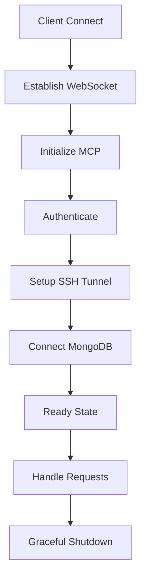

# MCP Server API Design

This document outlines the API design patterns and standards specific to Model Context Protocol (MCP) servers for the Nexus MongoDB integration.

## MCP Protocol Overview

### What is MCP?
The Model Context Protocol (MCP) is a standardized protocol for communication between AI models and external systems. It provides:
- Structured tool definitions for AI model capabilities
- Resource management for context sharing
- Prompt templates for consistent interactions
- Stateful conversation management

### Core Components
1. **Tools** - Defined capabilities the AI can execute
2. **Resources** - Data and context available to the AI
3. **Prompts** - Predefined interaction templates
4. **Schemas** - Structured data definitions

### MCP in Nexus Context
The Nexus MCP server acts as a bridge between AI models and the MongoDB research database, enabling:
- Natural language queries on clinical trial metadata
- Automated signal detection and analysis
- Intelligent data exploration
- Context-aware recommendations

## Tool Definition Standards

### Tool Structure
```typescript
interface MCPTool {
  name: string;
  description: string;
  inputSchema: JSONSchema;
  outputSchema: JSONSchema;
  examples?: ToolExample[];
  tags?: string[];
}
```

### Nexus MCP Tools

#### Query Tool
```json
{
  "name": "query_clinical_data",
  "description": "Query clinical trial metadata from MongoDB collections",
  "inputSchema": {
    "type": "object",
    "properties": {
      "collection": {
        "type": "string",
        "enum": ["trials", "datasets", "variables", "signals", "actions"],
        "description": "MongoDB collection to query"
      },
      "query": {
        "type": "object",
        "description": "MongoDB query filter"
      },
      "projection": {
        "type": "object",
        "description": "Fields to include/exclude"
      },
      "options": {
        "type": "object",
        "properties": {
          "limit": { "type": "number" },
          "skip": { "type": "number" },
          "sort": { "type": "object" }
        }
      }
    },
    "required": ["collection", "query"]
  }
}
```

#### Aggregation Tool
```json
{
  "name": "aggregate_statistics",
  "description": "Run aggregation pipelines on clinical trial data",
  "inputSchema": {
    "type": "object",
    "properties": {
      "collection": {
        "type": "string",
        "description": "Collection to aggregate"
      },
      "pipeline": {
        "type": "array",
        "items": {
          "type": "object"
        },
        "description": "MongoDB aggregation pipeline"
      }
    },
    "required": ["collection", "pipeline"]
  }
}
```

#### Signal Detection Tool
```json
{
  "name": "detect_signals",
  "description": "Detect statistical anomalies in clinical trial data",
  "inputSchema": {
    "type": "object",
    "properties": {
      "trialId": {
        "type": "string",
        "description": "Clinical trial identifier"
      },
      "datasetId": {
        "type": "string",
        "description": "Dataset to analyze"
      },
      "statisticalMethod": {
        "type": "string",
        "enum": ["z-score", "iqr", "isolation-forest", "custom"],
        "description": "Statistical method for anomaly detection"
      },
      "parameters": {
        "type": "object",
        "description": "Method-specific parameters"
      }
    },
    "required": ["trialId", "datasetId", "statisticalMethod"]
  }
}
```

### Tool Naming Conventions
- Use snake_case for tool names
- Start with action verb (query_, create_, update_, delete_, analyze_)
- Be specific about the resource (e.g., `query_clinical_trials` not just `query`)
- Group related tools with common prefixes

## Resource Management Patterns

### Resource Types
```typescript
interface MCPResource {
  uri: string;
  name: string;
  description: string;
  mimeType: string;
  metadata?: Record<string, any>;
}
```

### Nexus Resources

#### Database Schema Resource
```json
{
  "uri": "nexus://schema/mongodb",
  "name": "MongoDB Schema",
  "description": "Complete schema definition for all CMP collections",
  "mimeType": "application/json",
  "metadata": {
    "version": "1.0.0",
    "collections": ["trials", "datasets", "variables", "signals", "actions", "users", "organizations"]
  }
}
```

#### Statistical Methods Resource
```json
{
  "uri": "nexus://methods/statistical",
  "name": "Statistical Methods Catalog",
  "description": "Available statistical methods for signal detection",
  "mimeType": "application/json",
  "metadata": {
    "categories": ["outlier-detection", "trend-analysis", "correlation", "forecasting"]
  }
}
```

### Resource Access Patterns
```typescript
// List available resources
GET /mcp/resources

// Get specific resource
GET /mcp/resources/{resourceUri}

// Subscribe to resource updates
WebSocket: /mcp/resources/{resourceUri}/subscribe
```

## Prompt Handling Interfaces

### Prompt Template Structure
```typescript
interface MCPPrompt {
  name: string;
  description: string;
  arguments: PromptArgument[];
  template: string;
  examples?: PromptExample[];
}
```

### Clinical Trial Analysis Prompts

#### Signal Investigation Prompt
```json
{
  "name": "investigate_signal",
  "description": "Investigate a potential signal in clinical trial data",
  "arguments": [
    {
      "name": "signalId",
      "description": "ID of the signal to investigate",
      "required": true
    },
    {
      "name": "depth",
      "description": "Investigation depth (basic, detailed, comprehensive)",
      "required": false,
      "default": "detailed"
    }
  ],
  "template": "Investigate signal {{signalId}} with {{depth}} analysis. Include:\n1. Signal context and detection method\n2. Historical patterns\n3. Related signals\n4. Recommended actions\n5. Risk assessment"
}
```

#### Data Quality Assessment Prompt
```json
{
  "name": "assess_data_quality",
  "description": "Assess data quality for a clinical trial dataset",
  "arguments": [
    {
      "name": "datasetId",
      "description": "Dataset to assess",
      "required": true
    }
  ],
  "template": "Assess data quality for dataset {{datasetId}}:\n- Completeness metrics\n- Consistency checks\n- Outlier analysis\n- Missing data patterns\n- Recommendations for improvement"
}
```

## Request/Response Schemas for MCP

### Tool Invocation Request
```json
{
  "jsonrpc": "2.0",
  "method": "tools/call",
  "params": {
    "name": "query_clinical_data",
    "arguments": {
      "collection": "signals",
      "query": {
        "trialId": "NCT12345678",
        "severity": { "$in": ["high", "critical"] }
      },
      "options": {
        "limit": 10,
        "sort": { "detectedAt": -1 }
      }
    }
  },
  "id": "req_123"
}
```

### Tool Response
```json
{
  "jsonrpc": "2.0",
  "result": {
    "content": [
      {
        "type": "text",
        "text": "Found 3 high/critical signals for trial NCT12345678"
      },
      {
        "type": "tool_result",
        "tool_use_id": "tool_use_abc123",
        "content": {
          "signals": [...],
          "totalCount": 3,
          "metadata": {
            "executionTime": 45,
            "indexesUsed": ["trialId_1_severity_1"]
          }
        }
      }
    ]
  },
  "id": "req_123"
}
```

### Resource Request
```json
{
  "jsonrpc": "2.0",
  "method": "resources/read",
  "params": {
    "uri": "nexus://schema/mongodb/signals"
  },
  "id": "req_124"
}
```

### Prompt Execution Request
```json
{
  "jsonrpc": "2.0",
  "method": "prompts/execute",
  "params": {
    "name": "investigate_signal",
    "arguments": {
      "signalId": "sig_789xyz",
      "depth": "comprehensive"
    }
  },
  "id": "req_125"
}
```

## Error Handling in MCP Context

### MCP Error Structure
```json
{
  "jsonrpc": "2.0",
  "error": {
    "code": -32603,
    "message": "Internal error",
    "data": {
      "type": "DATABASE_ERROR",
      "details": "MongoDB connection timeout",
      "retry": true,
      "retryAfter": 5000
    }
  },
  "id": "req_123"
}
```

### Error Codes
- `-32700` - Parse error
- `-32600` - Invalid request
- `-32601` - Method not found
- `-32602` - Invalid params
- `-32603` - Internal error
- `-32000 to -32099` - Server errors (custom)

### Nexus-Specific Error Codes
- `-32001` - MongoDB connection error
- `-32002` - SSH tunnel failure
- `-32003` - Authentication failure
- `-32004` - Permission denied
- `-32005` - Resource not found
- `-32006` - Query timeout
- `-32007` - Invalid aggregation pipeline

## Connection Lifecycle Management

### Connection States
```typescript
enum ConnectionState {
  CONNECTING = "connecting",
  CONNECTED = "connected",
  AUTHENTICATED = "authenticated",
  READY = "ready",
  ERROR = "error",
  DISCONNECTING = "disconnecting",
  DISCONNECTED = "disconnected"
}
```

### Connection Flow


### Connection Configuration
```json
{
  "connection": {
    "websocket": {
      "url": "wss://mcp.nexus-cmp.com",
      "reconnect": true,
      "reconnectDelay": 1000,
      "maxReconnectAttempts": 5
    },
    "ssh": {
      "host": "bastion.nexus-cmp.com",
      "port": 22,
      "username": "mcp-service",
      "privateKeyPath": "/secrets/ssh/id_rsa"
    },
    "mongodb": {
      "uri": "mongodb://localhost:27017",
      "database": "nexus_research",
      "options": {
        "maxPoolSize": 10,
        "minPoolSize": 2,
        "maxIdleTimeMS": 60000
      }
    }
  }
}
```

### Health Check Endpoint
```json
GET /mcp/health

Response:
{
  "status": "healthy",
  "version": "1.0.0",
  "connections": {
    "websocket": "connected",
    "ssh": "active",
    "mongodb": "connected"
  },
  "uptime": 3600,
  "lastActivity": "2024-06-08T10:00:00Z"
}
```

## State Management Considerations

### Session State
```typescript
interface MCPSession {
  id: string;
  userId: string;
  organizationId: string;
  permissions: Permission[];
  context: {
    currentTrial?: string;
    currentDataset?: string;
    recentQueries: Query[];
    preferences: UserPreferences;
  };
  metadata: {
    createdAt: Date;
    lastActivity: Date;
    clientInfo: ClientInfo;
  };
}
```

### Context Persistence
- Session context stored in Redis with TTL
- Query history maintained for intelligent suggestions
- User preferences cached for performance
- Temporary results stored for pagination

### State Synchronization
```json
{
  "method": "sync/state",
  "params": {
    "sessionId": "sess_123",
    "state": {
      "currentView": "signals",
      "filters": {
        "severity": ["high", "critical"],
        "dateRange": "last-7-days"
      },
      "sortBy": "detectedAt"
    }
  }
}
```

## Security Considerations

### Authentication Flow
1. Client initiates MCP connection
2. Server challenges with nonce
3. Client signs nonce with private key
4. Server validates signature
5. Session token issued

### Authorization Model
```typescript
interface MCPAuthorization {
  tool: string;
  resource: string;
  action: string;
  constraints?: {
    organizations?: string[];
    trials?: string[];
    timeWindow?: TimeWindow;
  };
}
```

### Audit Logging
```json
{
  "timestamp": "2024-06-08T10:00:00Z",
  "sessionId": "sess_123",
  "userId": "user_456",
  "tool": "query_clinical_data",
  "arguments": {
    "collection": "signals",
    "query": { "trialId": "NCT12345678" }
  },
  "result": {
    "success": true,
    "recordsReturned": 10,
    "executionTime": 45
  }
}
```

## Performance Optimization

### Query Optimization
- Automatic index suggestion based on query patterns
- Query plan caching for repeated queries
- Aggregation pipeline optimization
- Result set streaming for large datasets

### Caching Strategy
- Resource definitions cached indefinitely
- Schema cached with version checking
- Query results cached with TTL based on data volatility
- User permissions cached per session

### Connection Pooling
- MongoDB connection pool per organization
- SSH tunnel reuse across sessions
- WebSocket multiplexing for concurrent requests
- Graceful degradation on connection limits

## Best Practices

### Tool Design
- Keep tools focused on single responsibilities
- Provide comprehensive descriptions
- Include examples in tool definitions
- Version tools for backward compatibility

### Error Handling
- Always return structured errors
- Include actionable error messages
- Provide retry guidance when appropriate
- Log errors with full context

### Performance
- Stream large results instead of loading in memory
- Use projection to limit data transfer
- Implement request cancellation
- Monitor and alert on slow queries

### Security
- Validate all inputs against schemas
- Implement rate limiting per user/organization
- Audit all data access
- Encrypt sensitive data in transit and at rest